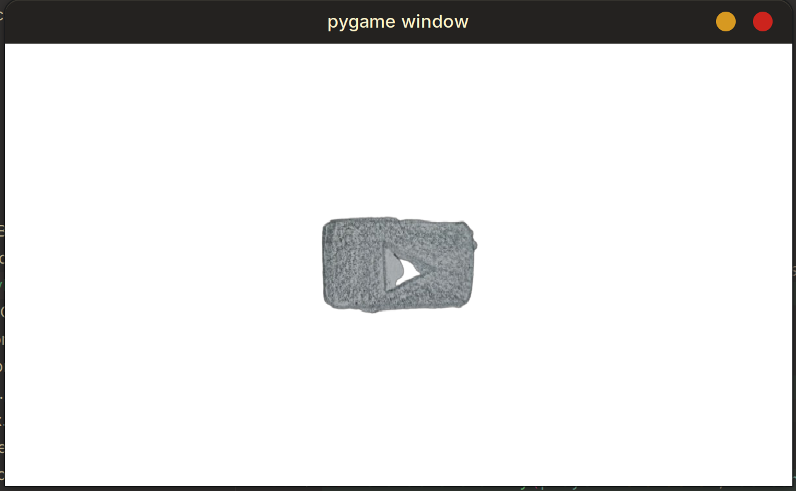
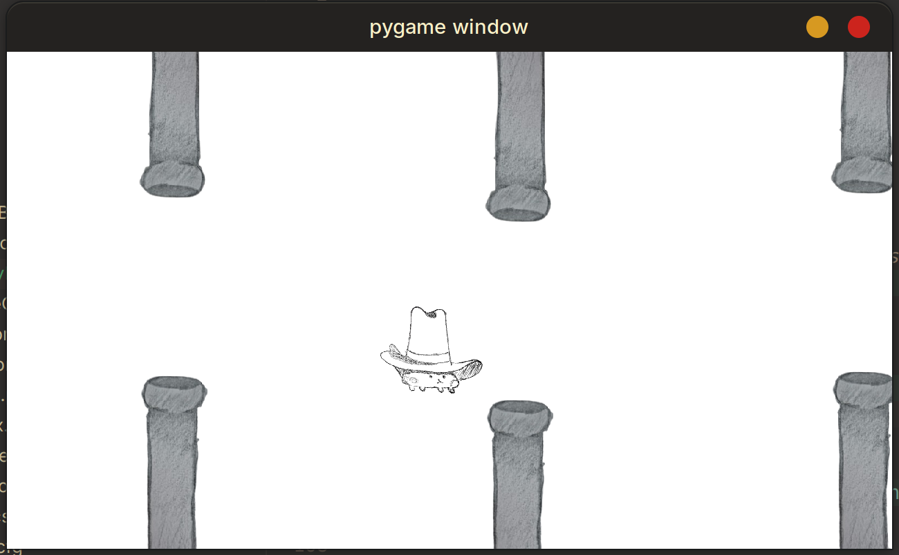
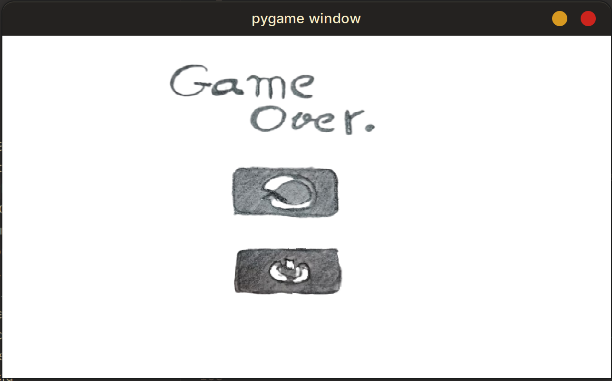

## Table of contents

- [Overview](#overview)
  - [The challenge](#the-challenge)
  - [Screenshot](#screenshot)
  - [Built with](#built-with)
- [Author](#author)
- [Acknowledgments](#acknowledgments)

## Overview
A very simple recreation of Flappy Bird using Python and the PyGame module.
### The challenge
I wanted to challenge myself to make use of the Python knowledge I gained through my studying to make a simple project before I move on to learning more specific modules in Python.
### Screenshot






## My process
It was a very simple process. I started off by recreating gravity and making the character jump when pressing the spacebar. Then I added in the pipes and figured out how they will be created and moved. Then added the slight randomization of their heights. And finally added the 'Game Over' and 'Start' screens.
### Built with

- Python
- [Pygame](https://www.pygame.org/news) - Python module


This is the function I use to show the 'start' screen.
```python
# Function that shows the starting screen with the 'play button'
def mainMenu(image: str) -> None:
    pygame.init()
    screen = pygame.display.set_mode((1280, 720))
    clock = pygame.time.Clock()
    font = pygame.font.SysFont("font", 20)

    playButton = pygame.image.load(image).convert_alpha()
    playButton = pygame.transform.scale(playButton, (700, 450))
    buttonRect = pygame.Rect((520, 290), (250, 150))

    screen.fill("white")

    screen.blit(playButton, (280, 130))

    while True:
        try:
            flag = True
            for event in pygame.event.get():
                if event.type == pygame.QUIT or (
                    event.type == pygame.KEYDOWN and event.key == pygame.K_ESCAPE
                ):
                    sys.exit()

                if event.type == pygame.KEYDOWN and event.key == pygame.K_RETURN:
                    flag = False
                    break
                if event.type == pygame.MOUSEBUTTONUP:
                    if buttonRect.collidepoint(event.pos):
                        flag = False
                        break

            pygame.display.update()
            pygame.display.flip()

            clock.tick(60)
            if not flag:
                break
        except pygame.error:
            pygame.quit()
            sys.exit()
    main()
```

## Author

- LinkedIn - [Omar Zarraa](www.linkedin.com/in/omar-zarraa-721b6935b)

## Acknowledgments

I would love to thank CS50 for their amazing [CS50P](https://youtube.com/playlist?list=PLT98CRl2KxKGj-VKtApD8-zCqSaN2mD4w&si=m7jTI0yOoHACoR-Y) Python course which taught me the fundamentals I needed to start learning more and creating projects using the language.